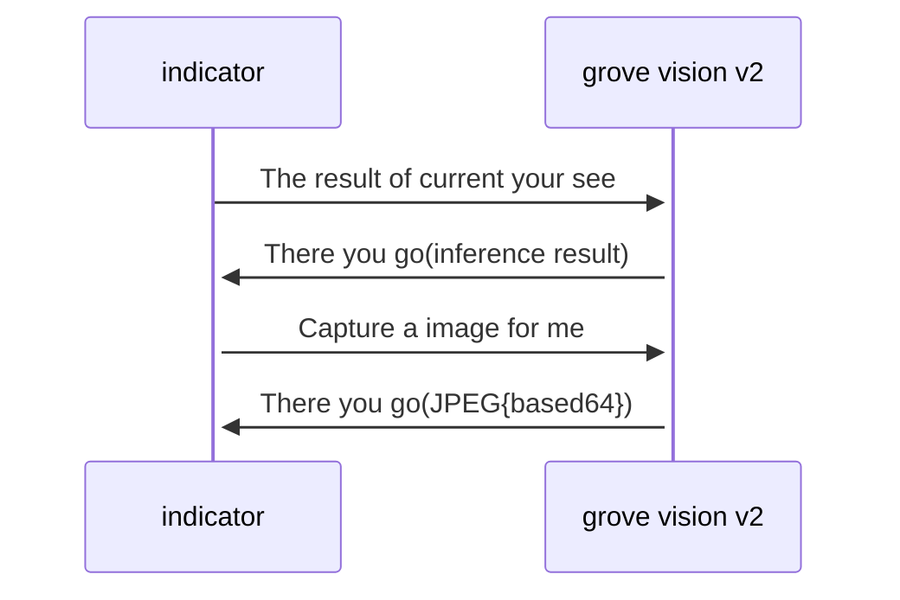

# Grove Vision V2 and SenseCAP indicator

This is a simple demo to show how to use the Grove Vision V2 and SenseCAP indicator. And this repo is contains the code of the SenseCAP indicator(ESP32 and RP2040) 

For Grove vision v2, navigate to the wiki page : 🤓[Using Grove Vision AI V2 with AT Commands](https://wiki.seeedstudio.com/grove_vision_ai_v2_at/)

The SenseCAP indicator get the result data and image from grove vision v2 via `UART` to draw the point, line and display the image.

https://github.com/Seeed-Projects/grove-visionv2-indicator/assets/45476879/75a35e7b-5f98-49f3-84b3-65873e9ef971

Let's see the diagram in below:

To get pose detection modle: [yolov8n_pose_256_vela_3_9_0x3BB000](https://github.com/HimaxWiseEyePlus/Seeed_Grove_Vision_AI_Module_V2/blob/main/model_zoo/tflm_yolov8_pose/yolov8n_pose_256_vela_3_9_0x3BB000.tflite), and then flash to the address: `0x400000` on the grove vision v2 via [SenseCraft-Web-Toolkit](https://seeed-studio.github.io/SenseCraft-Web-Toolkit/#/tool/tool).

Don't forget to set the resolution of Vision v2 to `240x240` by sending AT command: `AT+SENSOR=1,1,0`.

## Prerequisites

- Get and install ESP-IDF toolchain and its dependencies.
  [ESP-IDF Get started](https://docs.espressif.com/projects/esp-idf/en/latest/esp32/get-started/index.html)

  - Install ESP-IDF on Windows: [Description page](https://docs.espressif.com/projects/esp-idf/en/latest/esp32/get-started/windows-setup.html)
  - There's a ESP-related IDE too, made by Espressif, containing ESP-IDF, called Espressif-IDE which is based on Eclipse CDT. [Espressif-IDE](https://github.com/espressif/idf-eclipse-plugin/blob/master/docs/Espressif-IDE.md)
    - Get the [ESP-IDF offline Windows installer](https://dl.espressif.com/dl/idf-installer/esp-idf-tools-setup-offline-5.1.1.exe?) or [Espressif-IDE Windows installer](https://dl.espressif.com/dl/idf-installer/espressif-ide-setup-2.11.0-with-esp-idf-5.1.1.exe)
    - Install it on your Windows system accepting all offered options and default settings. This automagically installs Python, git, CMake, etc all at once under C:\Espressif folder.
    - You can start building in command-line from the PowerShell/CMD entries created in the start-menu, but with the help of the included build.bat you can build on a normal commandline too
    - Or you can build the project in the IDE GUI, see 'Usage' section.

More setup details in [ESP-IDF - How To Flash The Native Firmware](https://wiki.seeedstudio.com/SenseCAP_Indicator_How_To_Flash_The_Default_Firmware/)
